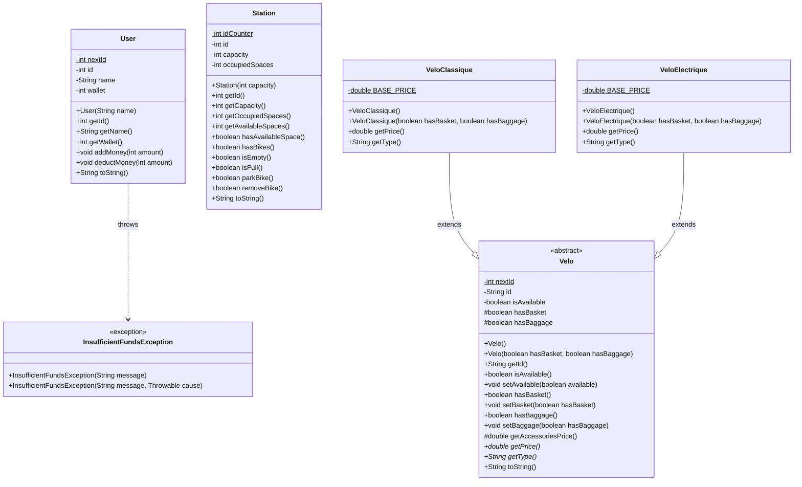

# [L3S5 COO] — Projet de conception orientée objet

Travail du binôme:

- Nathan Malengé
- Théo Debeer 

-----

## STRUCTURE : 

fil.l3.coo                                                      
├── Main                                                        
├── user/                                                       
│   ├── User                                                    
│   └── InsufficientFundsException                              
├── Velo/                                                       
│   ├── Velo (abstract)                                         
│   ├── VeloClassique                                           
│   └── VeloElectrique                                          
└── station/                                                    
    └── Station  

-----

## DIAGRAMME DE CLASSES

