# [L3S5 COO] — Projet de conception orientée objet

Travail du binôme:

- Nathan Malengé
- Théo Debeer 

**Introduction :**  
Ce projet implémente un système de gestion de location de véhicules urbains. Il permet de gérer des utilisateurs avec des portefeuilles, des stations de véhicules avec capacité limitée, différents types de véhicules auxquels on peut ajouter des accessoires via le pattern Decorator, et un système complet de location coordonnant l'ensemble. Le projet illustre l'application de principes de conception orientée objet avancés.

---

## HowTo

Toutes les commandes suivantes doivent être exécutées **depuis la racine du projet** (le dossier contenant `pom.xml`).

### Récupérer les sources du projet

```bash
git clone <git@gitlab-etu.fil.univ-lille.fr:nathan.malenge.etu/projet-coo-malenge-debeer.git> 
cd projet-coo-malenge-debeer
```

### Générer la documentation

```bash
mvn javadoc:javadoc
```

### Compiler et exécuter les sources

```bash
# Compiler
mvn clean compile

# Exécuter la classe principale
mvn exec:java -Dexec.mainClass="fil.l3.coo.Main"
```

### Compiler et exécuter les tests

```bash
mvn test
```

### Générer et exécuter l'archive (.jar)

```bash
# Générer le JAR
mvn clean package

# Exécuter le JAR
java -jar target/projet-coo-1.0-SNAPSHOT.jar
```

---

## Éléments de code important 

### 1. Pattern Decorator pour les accessoires

**Principe :** Le pattern Decorator permet d'ajouter dynamiquement des fonctionnalités à un objet sans modifier sa structure.

**Mise en œuvre :**
- `VehiculeComponent` : Interface définissant les composants des véhicules (getPrice, getDescription, isAvailable)
- `VehiculeDecorator` : Classe abstraite implémentant `VehiculeComponent` et contenant une référence vers un autre `VehiculeComponent`
- `BasketDecorator` et `BaggageDecorator` : Décorateurs ajoutant respectivement un panier (+0.5€) et un porte-bagages (+0.3€)

**Avantages :**
- Composition flexible : on peut combiner plusieurs accessoires
- Extension facile : ajouter un nouvel accessoire ne nécessite qu'une nouvelle classe de décorateur
- Respect du principe Open/Closed (ouvert à l'extension, fermé à la modification)

**Exemple d'utilisation :**
```java
VehiculeComponent velo = new VeloClassique();                    
velo = new BasketDecorator(velo);                               
velo = new BaggageDecorator(velo);                              
System.out.println(velo.getDescription() + " : " + velo.getPrice() + "€");
// Affiche : "VeloClassique + Basket + Baggage : 1.8€"
```

### 2. Hiérarchie des véhicules

**Structure :**
- `VehiculeComponent` (interface) : Composants de base pour tous les véhicules
- `Vehicule` (classe abstraite) : Implémente les fonctionnalités communes (disponibilité)
- `Velo` (classe abstraite) : Spécialisation pour les vélos
- `VeloClassique` et `VeloElectrique` : Implémentations concrètes avec prix différents

**Principe appliqué :** Polymorphisme et abstraction
- Les stations manipulent des `VehiculeComponent` sans connaître le type concret
- Extensibilité : ajout facile de nouveaux types de véhicules (trottinettes, scooters...)

### 3. Gestion robuste des exceptions

**Exceptions métier personnalisées :**

**Package `user.exceptions` :**
- `InsufficientFundsException` : Levée quand l'utilisateur n'a pas assez d'argent
- `NegativeAmountException` : Levée lors d'une tentative avec un montant négatif

**Package `station.exceptions` :**
- `StationFullException` : Levée quand on tente de garer un vélo dans une station pleine
- `BikeNotFoundException` : Levée quand on cherche un vélo absent de la station
- `NullBikeException` : Levée lors d'opérations sur un vélo null

**Avantages :**
- Séparation des erreurs métier et techniques
- Messages d'erreur explicites et localisés
- Meilleure gestion du flux d'exécution que des retours booléens

### 4. Conception de la classe Station

**Caractéristiques :**
- Utilise une `List<VehiculeComponent>` pour stocker les vélos
- Capacité contrainte entre 10 et 20 places (validation dans le constructeur)
- API claire avec méthodes de vérification : `isEmpty()`, `isFull()`, `hasAvailableSpace()`

**Points intéressants :**
- Les méthodes `parkBike()` et `removeBike()` lancent des exceptions explicites
- Encapsulation : `getParkedBikes()` retourne une copie de la liste (protection contre les modifications externes)
- Compatible avec le pattern Decorator : manipule l'interface `VehiculeComponent`

### 5. Classe User simplifiée mais complète

**Design :**
- Portefeuille en `double` pour gérer les centimes d'euro
- Pas d'identifiants ou de noms : focus sur la fonctionnalité métier
- Méthode `canAfford()` pour vérifier la solvabilité sans exception

**Principe appliqué :** Responsabilité unique (Single Responsibility Principle)
- `User` gère uniquement le portefeuille
- La logique de location est déléguée à `RentalSystem`

### 6. Système de location (RentalSystem)

**Principe :** Le `RentalSystem` coordonne les interactions entre utilisateurs, stations et véhicules pour gérer les locations.

**Mise en œuvre :**
- `Location` : Représente une transaction de location (utilisateur + véhicule loué)
- `RentalSystem` : Gère la logique métier de location et de retour
- **Exceptions métier dédiées** :
  - `RentalException` : Exception de base pour les opérations de location
  - `CannotAffordRentalException` : L'utilisateur n'a pas les fonds suffisants
  - `VehiculeNotAvailableException` : Le véhicule n'est pas disponible

**Fonctionnalités :**
- `rentVehicule()` : Loue un véhicule depuis une station
  - Vérifie la solvabilité de l'utilisateur
  - Retire le véhicule de la station
  - Déduit le coût du portefeuille
  - Crée et retourne un objet `Location`
- `returnVehicule()` : Retourne un véhicule à une station
  - Gère les cas où la station est pleine

**Avantages :**
- Séparation des responsabilités : la logique de location est isolée
- Gestion des erreurs avec exceptions 

**Exemple d'utilisation :**
```java
RentalSystem system = new RentalSystem();
User user = new User(10.0);
Station station = new Station(15);
VehiculeComponent velo = new VeloClassique();
station.parkBike(velo);

try {
    Location location = system.rentVehicule(user, station, velo);
    System.out.println("Location réussie : " + location);
    system.returnVehicule(location, station);
} catch (CannotAffordRentalException | VehiculeNotAvailableException e) {
    System.err.println("Erreur : " + e.getMessage());
}
```

### 7. Tests unitaires complets

**Organisation :**
- Tests pour chaque classe principale : `UserTest`, `StationTest`, `VehiculeTest`, `RentalSystemTest`
- Utilisation de JUnit 5 avec `@BeforeEach` pour l'initialisation
- Tests des cas nominaux et des cas d'erreur (exceptions)

**Couverture :**
- Tests des limites (capacité min/max des stations)
- Tests des comportements exceptionnels (montants négatifs, stations pleines)
- Tests du pattern Decorator (combinaisons d'accessoires)
- Tests du système de location (scénarios de location et retour)

---

## STRUCTURE : 

fil.l3.coo                                                      
├── Main                                                        
├── user/                                                       
│   ├── User                                                    
│   └── exceptions/                                             
│       ├── InsufficientFundsException                          
│       └── NegativeAmountException                             
├── vehicule/                                                   
│   ├── VehiculeComponent (interface)                           
│   ├── Vehicule (abstract)                                     
│   ├── decorator/                                              
│   │   ├── VehiculeDecorator (abstract)                        
│   │   ├── BasketDecorator                                     
│   │   └── BaggageDecorator                                    
│   └── velo/                                                   
│       ├── Velo (abstract)                                     
│       ├── VeloClassique                                       
│       └── VeloElectrique                                      
├── station/                                                    
│   ├── Station                                                 
│   └── exceptions/                                             
│       ├── BikeNotFoundException                               
│       ├── NullBikeException                                   
│       └── StationFullException                                
└── rental/                                                     
    ├── RentalSystem                                            
    ├── Location                                                
    └── exceptions/                                             
        ├── RentalException                                     
        ├── CannotAffordRentalException                         
        └── VehiculeNotAvailableException  

-----

## DIAGRAMME DE CLASSES

```mermaid
classDiagram
    class RentalSystem {
        +Location rentVehicule(User user, Station station, VehiculeComponent vehicule)
        +boolean returnVehicule(Location location, Station toStation)
    }
    
    class User {
        -double wallet
        +User()
        +User(double initialAmount)
        +double getWallet()
        +void addMoney(double amount)
        +void deductMoney(double amount)
        +boolean canAfford(double amount)
        +String toString()
    }
    
    class Station {
        -int capacity
        -List~VehiculeComponent~ parkedBikes
        +Station(int capacity)
        +int getOccupiedSpaces()
        +int getAvailableSpaces()
        +boolean hasAvailableSpace()
        +boolean hasAvailableBikes()
        +boolean hasBikes()
        +boolean isEmpty()
        +boolean isFull()
        +void parkBike(VehiculeComponent velo)
        +VehiculeComponent removeBike(VehiculeComponent velo)
        +List~VehiculeComponent~ getParkedBikes()
        +String toString()
    }
    
    class Location {
        -User user
        -VehiculeComponent vehicule
        +Location(User user, VehiculeComponent vehicule)
        +User getUser()
        +VehiculeComponent getVehicule()
        +double getCost()
        +String toString()
    }
    
    class VehiculeComponent {
        <<interface>>
        +double getPrice()
        +String getDescription()
        +boolean isAvailable()
        +void setAvailable(boolean available)
        +String getType()
    }
    
    class Vehicule {
        <<abstract>>
        -boolean available
        +Vehicule()
        +double getPrice()*
        +String getDescription()*
        +String getType()*
        +boolean isAvailable()
        +void setAvailable(boolean available)
        +String toString()
    }
    
    class Velo {
        <<abstract>>
        +Velo()
        +String getDescription()
        +double getPrice()*
        +String getType()*
        +String toString()
    }
    
    class VeloClassique {
        -double BASE_PRICE$
        +VeloClassique()
        +double getPrice()
        +String getType()
    }
    
    class VeloElectrique {
        -double BASE_PRICE$
        +VeloElectrique()
        +double getPrice()
        +String getType()
    }
    
    class VehiculeDecorator {
        <<abstract>>
        #VehiculeComponent vehicule
        +VehiculeDecorator(VehiculeComponent vehicule)
        +boolean isAvailable()
        +void setAvailable(boolean available)
        +String getType()
        +double getPrice()*
        +String getDescription()*
    }
    
    class BasketDecorator {
        -double BASKET_PRICE$
        +BasketDecorator(VehiculeComponent vehicule)
        +double getPrice()
        +String getDescription()
    }
    
    class BaggageDecorator {
        -double BAGGAGE_PRICE$
        +BaggageDecorator(VehiculeComponent vehicule)
        +double getPrice()
        +String getDescription()
    }
    
    class RentalException {
        <<exception>>
        +RentalException(String message)
        +RentalException(String message, Throwable cause)
    }
    
    class CannotAffordRentalException {
        <<exception>>
        +CannotAffordRentalException(String message)
    }
    
    class VehiculeNotAvailableException {
        <<exception>>
        +VehiculeNotAvailableException(String message)
    }
    
    class InsufficientFundsException {
        <<exception>>
        +InsufficientFundsException(String message)
    }
    
    class NegativeAmountException {
        <<exception>>
        +NegativeAmountException(String message)
    }
    
    class BikeNotFoundException {
        <<exception>>
        +BikeNotFoundException()
        +BikeNotFoundException(String message)
    }
    
    class NullBikeException {
        <<exception>>
        +NullBikeException()
        +NullBikeException(String message)
    }
    
    class StationFullException {
        <<exception>>
        +StationFullException()
        +StationFullException(String message)
    }
    

    RentalSystem --> Location : creates
    RentalSystem ..> User : uses
    RentalSystem ..> Station : uses
    RentalSystem ..> VehiculeComponent : uses
    
    Location --> User : has
    Location --> VehiculeComponent : has

    Station --> VehiculeComponent : stores 
    Vehicule --|> VehiculeComponent : implements
    Velo --|> Vehicule : extends
    VeloClassique --|> Velo : extends
    VeloElectrique --|> Velo : extends
    
    VehiculeDecorator --|> VehiculeComponent : implements
    VehiculeDecorator --> VehiculeComponent : decorates
    BasketDecorator --|> VehiculeDecorator : extends
    BaggageDecorator --|> VehiculeDecorator : extends
    
    CannotAffordRentalException --|> RentalException : extends
    VehiculeNotAvailableException --|> RentalException : extends
    
    RentalSystem ..> CannotAffordRentalException : throws
    RentalSystem ..> VehiculeNotAvailableException : throws
    
    User ..> InsufficientFundsException : throws
    User ..> NegativeAmountException : throws
    
    Station ..> BikeNotFoundException : throws
    Station ..> NullBikeException : throws
    Station ..> StationFullException : throws
```



---

## Principes de conception appliqués

1. **SOLID :**
   - **Single Responsibility** : Chaque classe a une responsabilité unique (User gère le portefeuille, Station gère les emplacements)
   - **Open/Closed** : Pattern Decorator permet l'extension sans modification
   - **Liskov Substitution** : Les sous-types (VeloClassique, VeloElectrique) sont substituables à Velo
   - **Interface Segregation** : VehiculeComponent ne définit que les méthodes nécessaires
   - **Dependency Inversion** : Station dépend de l'interface VehiculeComponent, pas des implémentations concrètes

2. **Design Patterns :**
   - **Decorator** : Pour les accessoires de véhicules (composition dynamique)
   - **Template Method** : Dans Vehicule (méthodes abstraites implémentées par les sous-classes)

3. **Bonnes pratiques :**
   - Encapsulation forte (attributs privés, getters/setters appropriés)
   - Validation des entrées avec exceptions métier
   - Documentation Javadoc complète
   - Tests unitaires 

---

## Technologies utilisées

- **Langage :** Java 11
- **Build Tool :** Maven 3.8+
- **Framework de test :** JUnit 5.10.0
- **Documentation :** Javadoc