# [L3S5 COO] — Projet de conception orientée objet

Travail du binôme:

- Nathan Malengé
- Théo Debeer

**Introduction :**
Ce projet implémente un système de gestion de location de véhicules urbains. Il permet de gérer des utilisateurs avec des portefeuilles, des stations de véhicules avec capacité limitée, différents types de véhicules auxquels on peut ajouter des accessoires via le pattern Decorator, et un système complet de location coordonnant l'ensemble. Le projet illustre l'application de principes de conception orientée objet avancés.


### Ce qu'il nous manque

- simulation temporelle
- Redistrib
- voleur

---

## HowTo

Toutes les commandes suivantes doivent être exécutées **depuis la racine du projet** (le dossier contenant `pom.xml`).

### Récupérer les sources du projet

```bash
git clone <git@gitlab-etu.fil.univ-lille.fr:nathan.malenge.etu/projet-coo-malenge-debeer.git> 
cd projet-coo-malenge-debeer
```

### Générer la documentation

```bash
mvn javadoc:javadoc
```

### Compiler et exécuter les sources

```bash
# Compiler
mvn clean compile

# Exécuter la classe principale
mvn exec:java -Dexec.mainClass="fil.l3.coo.Main"
```

### Compiler et exécuter les tests

```bash
mvn test
```

### Générer et exécuter l'archive (.jar)

```bash
# Générer le JAR
mvn clean package

# Exécuter le JAR
java -jar target/projet-coo-1.0-SNAPSHOT.jar
```

---

## Éléments de code important

### 1. Pattern Decorator pour les accessoires

**Principe :** Le pattern Decorator permet d'ajouter dynamiquement des fonctionnalités à un objet sans modifier sa structure.

**Mise en œuvre :**

- `VehiculeComponent` : Interface définissant les composants des véhicules (getPrice, getDescription, isAvailable)
- `VehiculeDecorator` : Classe abstraite implémentant `VehiculeComponent` et contenant une référence vers un autre `VehiculeComponent`
- `BasketDecorator` et `BaggageDecorator` : Décorateurs ajoutant respectivement un panier (+0.5€) et un porte-bagages (+0.3€)

**Avantages :**

- Composition flexible : on peut combiner plusieurs accessoires
- Extension facile : ajouter un nouvel accessoire ne nécessite qu'une nouvelle classe de décorateur
- Respect du principe Open/Closed (ouvert à l'extension, fermé à la modification)

**Exemple d'utilisation :**

```java
VehiculeComponent velo = new VeloClassique();                  
velo = new BasketDecorator(velo);                             
velo = new BaggageDecorator(velo);                            
System.out.println(velo.getDescription() + " : " + velo.getPrice() + "€");
// Affiche : "VeloClassique + Basket + Baggage : 1.8€"
```

### 2. Hiérarchie des véhicules

**Structure :**

- `VehiculeComponent` (interface) : Composants de base pour tous les véhicules
- `Vehicule` (classe abstraite) : Implémente les fonctionnalités communes (disponibilité)
- `Velo` (classe abstraite) : Spécialisation pour les vélos
- `VeloClassique` et `VeloElectrique` : Implémentations concrètes avec prix différents

**Principe appliqué :** Polymorphisme et abstraction

- Les stations manipulent des `VehiculeComponent` sans connaître le type concret
- Extensibilité : ajout facile de nouveaux types de véhicules (trottinettes, scooters...)

### 3. Gestion robuste des exceptions

**Exceptions métier personnalisées :**

**Package `user.exceptions` :**

- `InsufficientFundsException` : Levée quand l'utilisateur n'a pas assez d'argent
- `NegativeAmountException` : Levée lors d'une tentative avec un montant négatif

**Package `station.exceptions` :**

- `StationFullException` : Levée quand on tente de garer un vélo dans une station pleine
- `VehiculeNotFoundException` : Levée quand on cherche un véhicule absent de la station
- `NullVehiculeException` : Levée lors d'opérations sur un véhicule null

**Avantages :**

- Séparation des erreurs métier et techniques
- Messages d'erreur explicites et localisés
- Meilleure gestion du flux d'exécution que des retours booléens

### 4. Conception de la classe Station

**Caractéristiques :**

- Utilise une `List<VehiculeComponent>` pour stocker les vélos
- Capacité contrainte entre 10 et 20 places (validation dans le constructeur)
- API claire avec méthodes de vérification : `isEmpty()`, `isFull()`, `hasAvailableSpace()`

**Points intéressants :**

- Les méthodes `parkBike()` et `removeBike()` lancent des exceptions explicites
- Encapsulation : `getParkedBikes()` retourne une copie de la liste (protection contre les modifications externes)
- Compatible avec le pattern Decorator : manipule l'interface `VehiculeComponent`

### 5. Classe User simplifiée mais complète

**Design :**

- Portefeuille en `double` pour gérer les centimes d'euro
- Pas d'identifiants ou de noms : focus sur la fonctionnalité métier
- Méthode `canAfford()` pour vérifier la solvabilité sans exception

**Principe appliqué :** Responsabilité unique (Single Responsibility Principle)

- `User` gère uniquement le portefeuille
- La logique de location est déléguée à `RentalSystem`

### 6. Système de location (RentalSystem)

**Principe :** Le `RentalSystem` coordonne les interactions entre utilisateurs, stations et véhicules pour gérer les locations.

**Mise en œuvre :**

- `Location` : Représente une transaction de location (utilisateur + véhicule loué)
- `RentalSystem` : Gère la logique métier de location et de retour
- **Exceptions métier dédiées** :
  - `RentalException` : Exception de base pour les opérations de location
  - `CannotAffordRentalException` : L'utilisateur n'a pas les fonds suffisants
  - `VehiculeNotAvailableException` : Le véhicule n'est pas disponible

**Fonctionnalités :**

- `rentVehicule()` : Loue un véhicule depuis une station
  - Vérifie la solvabilité de l'utilisateur
  - Retire le véhicule de la station
  - Déduit le coût du portefeuille
  - Crée et retourne un objet `Location`
- `returnVehicule()` : Retourne un véhicule à une station
  - Gère les cas où la station est pleine

**Avantages :**

- Séparation des responsabilités : la logique de location est isolée
- Gestion des erreurs avec exceptions

**Exemple d'utilisation :**

```java
RentalSystem system = new RentalSystem();
User user = new User(10.0);
Station station = new Station(15);
VehiculeComponent velo = new VeloClassique();
station.parkVehicule(velo);

try {
    Location location = system.rentVehicule(user, station, velo);
    System.out.println("Location réussie : " + location);
    system.returnVehicule(location, station);
} catch (CannotAffordRentalException | VehiculeNotAvailableException e) {
    System.err.println("Erreur : " + e.getMessage());
}
```

### 7. Centre de Contrôle et Pattern Observer

**Principe :** Le Centre de Contrôle supervise l'ensemble de la flotte de véhicules et des stations. Il utilise le **Pattern Observer** pour être notifié automatiquement à chaque dépôt ou retrait de véhicule.

**Mise en œuvre :**

- `StationObserver` : Interface définissant les méthodes de notification (`onVehicleParked`, `onVehicleRemoved`)
- `Station<T>` : Station générique qui maintient une liste d'observateurs et les notifie à chaque opération
- `ControlCenter` : Implémente `StationObserver` pour surveiller toutes les stations enregistrées

**Fonctionnalités du ControlCenter :**

- Enregistrement/désenregistrement de stations
- Réception de notifications en temps réel pour chaque dépôt/retrait
- Historique des événements par station
- Statistiques de la flotte (total véhicules, capacité totale)
- Affichage du résumé de la flotte

**Avantages :**

- Couplage faible entre les stations et le centre de contrôle
- Extensible : d'autres observateurs peuvent facilement être ajoutés
- Conforme aux exigences du sujet (notification à chaque opération)
- Prépare le terrain pour la redistribution automatique des véhicules

**Exemple d'utilisation :**

```java
ControlCenter controlCenter = new ControlCenter();
Station<VehiculeComponent> station = new Station<>(15);
controlCenter.registerStation(station);

// Les opérations sur la station notifient automatiquement le centre
station.parkVehicule(velo); // → Notification envoyée au ControlCenter
controlCenter.printFleetSummary(); // Affiche les statistiques de la flotte
```

### 8. Station Générique avec Identifiants Uniques

**Principe :** Les stations sont maintenant génériques (`Station<T extends VehiculeComponent>`) pour assurer la type-safety et possèdent des identifiants uniques comme requis par le sujet.

**Caractéristiques :**

- Type générique `T` permettant de créer des stations spécialisées par type de véhicule
- ID unique auto-généré pour chaque station
- Support du Pattern Observer intégré
- Méthodes renommées pour être génériques (`parkVehicule`, `removeVehicule`, `getParkedVehicules`)

**Avantages :**

- Type-safety : empêche le mélange de différents types de véhicules dans une même station
- Identifiants uniques facilitent le suivi et la gestion de la flotte
- Extensible pour d'autres types de véhicules (trottinettes, scooters, etc.)

### 9. Pattern State pour le cycle de vie des véhicules

**Principe :** Le Pattern State permet à un véhicule de changer de comportement selon son état actuel. Chaque état définit quelles transitions sont possibles et quelles opérations sont autorisées.

**Mise en œuvre :**

- `VehiculeState` : Interface définissant le contrat pour tous les états (canBeRented, rent, returnVehicule, sendToMaintenance, markAsStolen)
- `DisponibleState` : État initial, véhicule disponible pour location
- `EnLocationState` : Véhicule actuellement loué à un utilisateur
- `EnMaintenanceState` : Véhicule en cours de maintenance par un réparateur
- `HorsServiceState` : Véhicule hors service (transition vers maintenance)
- `VoleState` : État terminal, véhicule volé (plus aucune transition possible)

**Fonctionnalités :**

- **Suivi automatique des locations** : Compteur incrémenté à chaque location
- **Maintenance automatique** : Après 10 locations, retour automatique vers maintenance
- **Suivi du temps d'inactivité** : Compteur d'intervalles sans location
- **Risque de vol** : Après 2 intervalles d'inactivité, véhicule marquable comme volé
- **Transitions d'état validées** : Chaque état définit ses transitions autorisées

**Avantages :**

- Gestion explicite du cycle de vie des véhicules
- Prévention des opérations invalides (ex: louer un véhicule volé)
- Maintenance préventive automatique basée sur l'utilisation
- Extension facile : ajout de nouveaux états sans modifier le code existant
- Conforme aux exigences du sujet (gestion de la maintenance et du vol)

**Exemple d'utilisation :**

```java
Vehicule velo = new VeloClassique();
System.out.println(velo.getStateName()); // "DISPONIBLE"

// Location
velo.getState().rent(velo);
System.out.println(velo.getStateName()); // "EN_LOCATION"

// Retour
velo.getState().returnVehicule(velo);
System.out.println(velo.getStateName()); // "DISPONIBLE"

// Après 10 locations, retour automatique vers maintenance
for (int i = 0; i < 10; i++) {
    velo.getState().rent(velo);
    velo.getState().returnVehicule(velo);
}
System.out.println(velo.getStateName()); // "HORS_SERVICE"
```

### 10. Pattern Visitor pour la maintenance des véhicules

**Principe :** Le Pattern Visitor permet d'ajouter de nouvelles opérations sur les véhicules sans modifier leurs classes. Il sépare les algorithmes de maintenance des structures de véhicules sur lesquelles ils opèrent.

**Mise en œuvre :**

- `VehicleService` : Interface définissant le contrat pour tous les services de maintenance (service, getServiceType)
- `Repairer` : Implémentation concrète effectuant les réparations sur les véhicules
- `ControlCenter` : Gère une liste de services disponibles pour la flotte

**Fonctionnalités :**

- **Réparation des véhicules** : Le `Repairer` peut réparer un véhicule en état `EN_MAINTENANCE`
- **Gestion des décorateurs** : Unwrap automatique des décorateurs pour accéder au véhicule de base
- **Intégration avec le State pattern** : Vérifie l'état du véhicule avant la réparation
- **Extensibilité** : Nouveaux services (nettoyage, inspection) peuvent être ajoutés facilement

**Avantages :**

- Séparation des responsabilités entre véhicules et services
- Extension facile : ajout de nouveaux services sans modifier les classes de véhicules
- Respect du principe Open/Closed
- Compatible avec les patterns Decorator et State

**Exemple d'utilisation :**

```java
Vehicule velo = new VeloClassique();
velo.getState().sendToMaintenance(velo);
System.out.println(velo.getStateName()); // "EN_MAINTENANCE"

Repairer repairer = new Repairer();
repairer.service(velo);
System.out.println(velo.getStateName()); // "DISPONIBLE"
System.out.println(velo.getRentalCount()); // 0 (compteur réinitialisé)
```

### 11. Tests unitaires complets

**Organisation :**

- Tests pour chaque classe principale : `UserTest`, `StationTest`, `VehiculeTest`, `RentalSystemTest`, `ControlCenterTest`, `VehicleServiceTest`
- Utilisation de JUnit 5 avec `@BeforeEach` pour l'initialisation
- Tests des cas nominaux et des cas d'erreur (exceptions)

**Couverture :**

- Tests des limites (capacité min/max des stations)
- Tests des comportements exceptionnels (montants négatifs, stations pleines)
- Tests du pattern Decorator (combinaisons d'accessoires)
- Tests du système de location (scénarios de location et retour)
- Tests du Pattern Observer (notifications du ControlCenter)
- Tests de l'unicité des IDs de stations
- Tests du Pattern State (transitions d'état, maintenance automatique, vol)
- Tests du Pattern Visitor (réparation des véhicules, gestion des états)
- Tests des véhicules spécifiques (VeloClassique, VeloElectrique avec prix et types)
- Tests de la classe Location (getters, coût, toString)

---

## STRUCTURE :

fil.l3.coo
├── Main
├── control/
│   ├── ControlCenter
│   ├── VehicleService (interface)
│   └── Repairer
├── user/
│   ├── User
│   └── exceptions/
│       ├── InsufficientFundsException
│       └── NegativeAmountException
├── vehicule/
│   ├── VehiculeComponent (interface)
│   ├── Vehicule (abstract)
│   ├── decorator/
│   │   ├── VehiculeDecorator (abstract)
│   │   ├── BasketDecorator
│   │   └── BaggageDecorator
│   ├── state/
│   │   ├── VehiculeState (interface)
│   │   ├── DisponibleState
│   │   ├── EnLocationState
│   │   ├── EnMaintenanceState
│   │   ├── HorsServiceState
│   │   └── VoleState
│   └── velo/
│       ├── Velo (abstract)
│       ├── VeloClassique
│       └── VeloElectrique
├── station/
│   ├── Station<T>
│   ├── StationObserver (interface)
│   └── exceptions/
│       ├── VehiculeNotFoundException
│       ├── NullVehiculeException
│       └── StationFullException
└── rental/
    ├── RentalSystem
    ├── Location
    └── exceptions/
        ├── RentalException
        ├── CannotAffordRentalException
        └── VehiculeNotAvailableException

---

## DIAGRAMME DE CLASSES

```mermaid
classDiagram
    class RentalSystem {
        +Location rentVehicule(User user, Station station, VehiculeComponent vehicule)
        +boolean returnVehicule(Location location, Station toStation)
    }
  
    class User {
        -double wallet
        +User()
        +User(double initialAmount)
        +double getWallet()
        +void addMoney(double amount)
        +void deductMoney(double amount)
        +boolean canAfford(double amount)
        +String toString()
    }
  
    class Station {
        -int id
        -int capacity
        -List~VehiculeComponent~ parkedVehicules
        -List~StationObserver~ observers
        +Station(int capacity)
        +int getId()
        +void addObserver(StationObserver observer)
        +void removeObserver(StationObserver observer)
        +int getOccupiedSpaces()
        +int getAvailableSpaces()
        +boolean hasAvailableSpace()
        +boolean hasAvailableVehicules()
        +boolean hasVehicules()
        +boolean isEmpty()
        +boolean isFull()
        +void parkVehicule(VehiculeComponent vehicule)
        +VehiculeComponent removeVehicule(VehiculeComponent vehicule)
        +List~VehiculeComponent~ getParkedVehicules()
        +String toString()
    }
    
    class StationObserver {
        <<interface>>
        +void onVehicleParked(Station station, VehiculeComponent vehicule)
        +void onVehicleRemoved(Station station, VehiculeComponent vehicule)
    }
    
    class ControlCenter {
        -List~Station~ stations
        -Map~Integer, List~String~~ stationEvents
        -List~VehicleService~ services
        +ControlCenter()
        +void registerService(VehicleService service)
        +List~VehicleService~ getServices()
        +void registerStation(Station station)
        +void unregisterStation(Station station)
        +List~Station~ getStations()
        +int getTotalVehicles()
        +int getTotalCapacity()
        +List~String~ getStationEvents(int stationId)
        +void printFleetSummary()
    }
  
    class Location {
        -User user
        -VehiculeComponent vehicule
        +Location(User user, VehiculeComponent vehicule)
        +User getUser()
        +VehiculeComponent getVehicule()
        +double getCost()
        +String toString()
    }
  
    class VehiculeComponent {
        <<interface>>
        +double getPrice()
        +String getDescription()
        +boolean isAvailable()
        +void setAvailable(boolean available)
        +String getType()
    }
  
    class Vehicule {
        <<abstract>>
        -boolean available
        -VehiculeState state
        -int rentalCount
        -int idleTimeIntervals
        +Vehicule()
        +double getPrice()*
        +String getDescription()*
        +String getType()*
        +boolean isAvailable()
        +void setAvailable(boolean available)
        +VehiculeState getState()
        +void setState(VehiculeState state)
        +String getStateName()
        +int getRentalCount()
        +void incrementRentalCount()
        +void resetRentalCount()
        +boolean needsMaintenance()
        +int getIdleTimeIntervals()
        +void incrementIdleTime()
        +void resetIdleTime()
        +boolean isAtRiskOfTheft()
        +String toString()
    }
    
    class VehiculeState {
        <<interface>>
        +boolean canBeRented()
        +boolean canBeReturned()
        +boolean canBeRedistributed()
        +void rent(Vehicule vehicule)
        +void returnVehicule(Vehicule vehicule)
        +void sendToMaintenance(Vehicule vehicule)
        +void markAsStolen(Vehicule vehicule)
        +String getStateName()
    }
    
    class DisponibleState {
        +boolean canBeRented()
        +boolean canBeReturned()
        +boolean canBeRedistributed()
        +void rent(Vehicule vehicule)
        +void returnVehicule(Vehicule vehicule)
        +void sendToMaintenance(Vehicule vehicule)
        +void markAsStolen(Vehicule vehicule)
        +String getStateName()
    }
    
    class EnLocationState {
        +boolean canBeRented()
        +boolean canBeReturned()
        +boolean canBeRedistributed()
        +void rent(Vehicule vehicule)
        +void returnVehicule(Vehicule vehicule)
        +void sendToMaintenance(Vehicule vehicule)
        +void markAsStolen(Vehicule vehicule)
        +String getStateName()
    }
    
    class EnMaintenanceState {
        +boolean canBeRented()
        +boolean canBeReturned()
        +boolean canBeRedistributed()
        +void rent(Vehicule vehicule)
        +void returnVehicule(Vehicule vehicule)
        +void sendToMaintenance(Vehicule vehicule)
        +void markAsStolen(Vehicule vehicule)
        +void completeMaintenance(Vehicule vehicule)
        +String getStateName()
    }
    
    class HorsServiceState {
        +boolean canBeRented()
        +boolean canBeReturned()
        +boolean canBeRedistributed()
        +void rent(Vehicule vehicule)
        +void returnVehicule(Vehicule vehicule)
        +void sendToMaintenance(Vehicule vehicule)
        +void markAsStolen(Vehicule vehicule)
        +String getStateName()
    }
    
    class VoleState {
        +boolean canBeRented()
        +boolean canBeReturned()
        +boolean canBeRedistributed()
        +void rent(Vehicule vehicule)
        +void returnVehicule(Vehicule vehicule)
        +void sendToMaintenance(Vehicule vehicule)
        +void markAsStolen(Vehicule vehicule)
        +String getStateName()
    }
  
    class Velo {
        <<abstract>>
        +Velo()
        +String getDescription()
        +double getPrice()*
        +String getType()*
        +String toString()
    }
  
    class VeloClassique {
        -double BASE_PRICE$
        +VeloClassique()
        +double getPrice()
        +String getType()
    }
  
    class VeloElectrique {
        -double BASE_PRICE$
        +VeloElectrique()
        +double getPrice()
        +String getType()
    }
  
    class VehiculeDecorator {
        <<abstract>>
        #VehiculeComponent vehicule
        +VehiculeDecorator(VehiculeComponent vehicule)
        +boolean isAvailable()
        +void setAvailable(boolean available)
        +String getType()
        +double getPrice()*
        +String getDescription()*
    }
  
    class BasketDecorator {
        -double BASKET_PRICE$
        +BasketDecorator(VehiculeComponent vehicule)
        +double getPrice()
        +String getDescription()
    }
  
    class BaggageDecorator {
        -double BAGGAGE_PRICE$
        +BaggageDecorator(VehiculeComponent vehicule)
        +double getPrice()
        +String getDescription()
    }
  
    class RentalException {
        <<exception>>
        +RentalException(String message)
        +RentalException(String message, Throwable cause)
    }
  
    class CannotAffordRentalException {
        <<exception>>
        +CannotAffordRentalException(String message)
    }
  
    class VehiculeNotAvailableException {
        <<exception>>
        +VehiculeNotAvailableException(String message)
    }
  
    class InsufficientFundsException {
        <<exception>>
        +InsufficientFundsException(String message)
    }
  
    class NegativeAmountException {
        <<exception>>
        +NegativeAmountException(String message)
    }
    
    class VehiculeNotFoundException {
        <<exception>>
        +VehiculeNotFoundException()
        +VehiculeNotFoundException(String message)
    }
    
    class NullVehiculeException {
        <<exception>>
        +NullVehiculeException()
        +NullVehiculeException(String message)
    }
  
    class StationFullException {
        <<exception>>
        +StationFullException()
        +StationFullException(String message)
    }
    
    class VehicleService {
        <<interface>>
        +boolean service(Station station, VehiculeComponent vehicule)
        +String getServiceType()
    }
    
    class Repairer {
        +boolean service(Station station, VehiculeComponent vehicule)
        +String getServiceType()
        +boolean repair(Station station, VehiculeComponent vehicule)
    }
    
    %% Relations d'héritage - Véhicules
    Vehicule --|> VehiculeComponent : implements
    Velo --|> Vehicule : extends
    VeloClassique --|> Velo : extends
    VeloElectrique --|> Velo : extends
    
    %% Relations d'héritage - Decorators
    VehiculeDecorator --|> VehiculeComponent : implements
    BasketDecorator --|> VehiculeDecorator : extends
    BaggageDecorator --|> VehiculeDecorator : extends
    
    %% Relations d'héritage - States
    DisponibleState --|> VehiculeState : implements
    EnLocationState --|> VehiculeState : implements
    EnMaintenanceState --|> VehiculeState : implements
    HorsServiceState --|> VehiculeState : implements
    VoleState --|> VehiculeState : implements
    
    %% Relations d'héritage - Exceptions
    CannotAffordRentalException --|> RentalException : extends
    VehiculeNotAvailableException --|> RentalException : extends
    
    %% Pattern Observer
    ControlCenter --|> StationObserver : implements
    Station --> StationObserver : notifies
    
    %% Pattern State
    Vehicule --> VehiculeState : has current state
    
    %% Pattern Visitor
    Repairer --|> VehicleService : implements
    ControlCenter --> VehicleService : manages
    
    %% Compositions importantes
    VehiculeDecorator --> VehiculeComponent : wraps
    Location --> User : user
    Location --> VehiculeComponent : vehicule
    Station --> VehiculeComponent : parkedVehicules
    ControlCenter --> Station : manages
```



---

## Principes de conception appliqués

1. **SOLID :**

   - **Single Responsibility** : Chaque classe a une responsabilité unique (User gère le portefeuille, Station gère les emplacements, ControlCenter gère la supervision)
   - **Open/Closed** : Pattern Decorator permet l'extension sans modification, Station générique facilite l'ajout de nouveaux types de véhicules
   - **Liskov Substitution** : Les sous-types (VeloClassique, VeloElectrique) sont substituables à Velo
   - **Interface Segregation** : VehiculeComponent et StationObserver ne définissent que les méthodes nécessaires
   - **Dependency Inversion** : Station dépend de l'interface VehiculeComponent et StationObserver, pas des implémentations concrètes
2. **Design Patterns :**

   - **Decorator** : Pour les accessoires de véhicules (composition dynamique)
   - **Observer** : Pour la notification du Centre de Contrôle à chaque opération sur les stations
   - **State** : Pour la gestion du cycle de vie des véhicules (disponible, en location, en maintenance, hors service, volé)
   - **Visitor** : Pour la maintenance des véhicules (VehicleService, Repairer)
   - **Template Method** : Dans Vehicule (méthodes abstraites implémentées par les sous-classes)
   - **Generic Types** : Station<T> pour la type-safety et l'extensibilité
3. **Bonnes pratiques :**

   - Encapsulation forte (attributs privés, getters/setters appropriés)
   - Validation des entrées avec exceptions métier
   - Documentation Javadoc complète
   - Tests unitaires

---

## Technologies utilisées

- **Langage :** Java 11
- **Build Tool :** Maven 3.8+
- **Framework de test :** JUnit 5.10.0
- **Documentation :** Javadoc
