# [L3S5 COO] — Projet de conception orientée objet

Travail du binôme:

- Nathan Malengé
- Théo Debeer 

-----

## STRUCTURE : 

fil.l3.coo                                                      
├── Main                                                        
├── user/                                                       
│   ├── User                                                    
│   └── exceptions/                                             
│       ├── InsufficientFundsException                          
│       └── NegativeAmountException                             
├── vehicule/                                                   
│   ├── VehiculeComponent (interface)                           
│   ├── Vehicule (abstract)                                     
│   ├── decorator/                                              
│   │   ├── VehiculeDecorator (abstract)                        
│   │   ├── BasketDecorator                                     
│   │   └── BaggageDecorator                                    
│   └── velo/                                                   
│       ├── Velo (abstract)                                     
│       ├── VeloClassique                                       
│       └── VeloElectrique                                      
└── station/                                                    
    ├── Station                                                 
    └── exceptions/                                             
        ├── BikeNotFoundException                               
        ├── NullBikeException                                   
        └── StationFullException  

-----

## DIAGRAMME DE CLASSES

```mermaid
classDiagram
    %% User Exceptions
    class InsufficientFundsException {
        <<exception>>
        +InsufficientFundsException(String message)
    }
    
    class NegativeAmountException {
        <<exception>>
        +NegativeAmountException(String message)
    }
    
    %% Station Exceptions
    class BikeNotFoundException {
        <<exception>>
        +BikeNotFoundException()
        +BikeNotFoundException(String message)
    }
    
    class NullBikeException {
        <<exception>>
        +NullBikeException()
        +NullBikeException(String message)
    }
    
    class StationFullException {
        <<exception>>
        +StationFullException()
        +StationFullException(String message)
    }
    
    %% User class
    class User {
        -double wallet
        +User()
        +User(double initialAmount)
        +double getWallet()
        +void addMoney(double amount)
        +void deductMoney(double amount)
        +boolean canAfford(double amount)
        +String toString()
    }
    
    %% Station class
    class Station {
        -int capacity
        -List~VehiculeComponent~ parkedBikes
        +Station(int capacity)
        +int getOccupiedSpaces()
        +int getAvailableSpaces()
        +boolean hasAvailableSpace()
        +boolean hasAvailableBikes()
        +boolean hasBikes()
        +boolean isEmpty()
        +boolean isFull()
        +void parkBike(VehiculeComponent velo)
        +VehiculeComponent removeBike(VehiculeComponent velo)
        +List~VehiculeComponent~ getParkedBikes()
        +String toString()
    }
    
    %% VehiculeComponent interface
    class VehiculeComponent {
        <<interface>>
        +double getPrice()
        +String getDescription()
        +boolean isAvailable()
        +void setAvailable(boolean available)
        +String getType()
    }
    
    %% Abstract Vehicule class
    class Vehicule {
        <<abstract>>
        -boolean available
        +Vehicule()
        +double getPrice()*
        +String getDescription()*
        +String getType()*
        +boolean isAvailable()
        +void setAvailable(boolean available)
        +String toString()
    }
    
    %% Abstract Velo class
    class Velo {
        <<abstract>>
        +Velo()
        +String getDescription()
        +double getPrice()*
        +String getType()*
        +String toString()
    }
    
    %% VeloClassique class
    class VeloClassique {
        -double BASE_PRICE$
        +VeloClassique()
        +double getPrice()
        +String getType()
    }
    
    %% VeloElectrique class
    class VeloElectrique {
        -double BASE_PRICE$
        +VeloElectrique()
        +double getPrice()
        +String getType()
    }
    
    %% Abstract Decorator
    class VehiculeDecorator {
        <<abstract>>
        #VehiculeComponent vehicule
        +VehiculeDecorator(VehiculeComponent vehicule)
        +boolean isAvailable()
        +void setAvailable(boolean available)
        +String getType()
        +double getPrice()*
        +String getDescription()*
    }
    
    %% Concrete Decorators
    class BasketDecorator {
        -double BASKET_PRICE$
        +BasketDecorator(VehiculeComponent vehicule)
        +double getPrice()
        +String getDescription()
    }
    
    class BaggageDecorator {
        -double BAGGAGE_PRICE$
        +BaggageDecorator(VehiculeComponent vehicule)
        +double getPrice()
        +String getDescription()
    }
    
    %% Relationships - Héritage (plus fort)
    Vehicule --|> VehiculeComponent : implements
    Velo --|> Vehicule : extends
    VeloClassique --|> Velo : extends
    VeloElectrique --|> Velo : extends
    
    VehiculeDecorator --|> VehiculeComponent : implements
    BasketDecorator --|> VehiculeDecorator : extends
    BaggageDecorator --|> VehiculeDecorator : extends
    
    %% Composition/Association
    VehiculeDecorator --> VehiculeComponent : decorates
    
    %% Exceptions
    User ..> InsufficientFundsException : throws
    User ..> NegativeAmountException : throws
    
    Station ..> BikeNotFoundException : throws
    Station ..> NullBikeException : throws
    Station ..> StationFullException : throws
```

